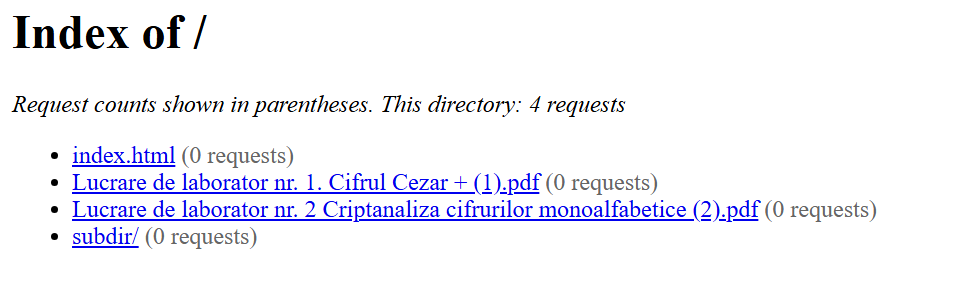
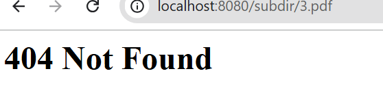
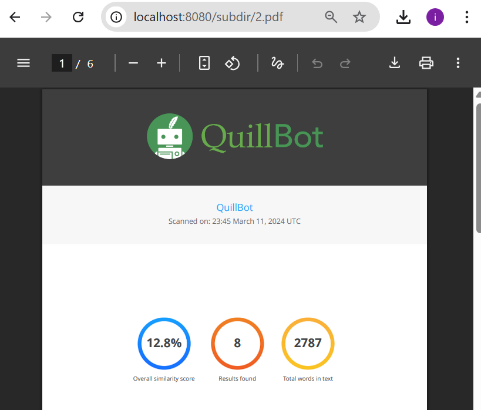
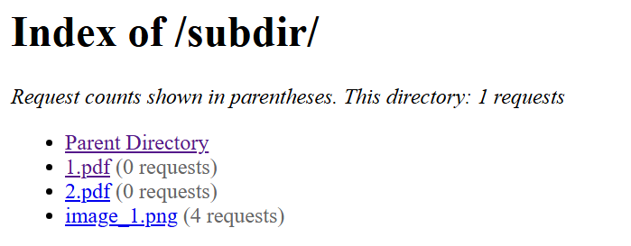
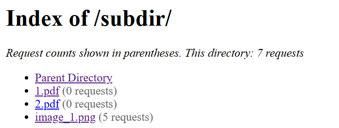
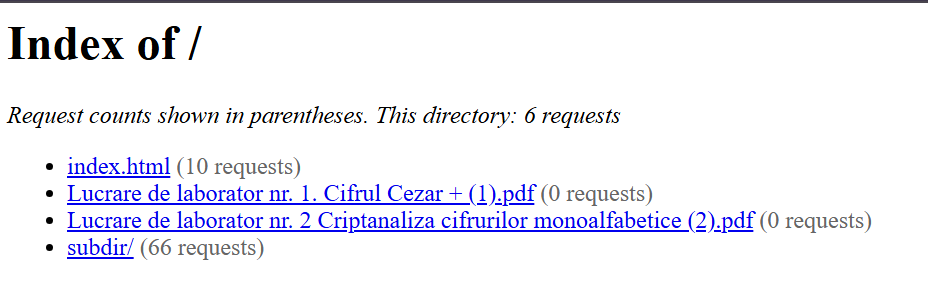

# Laboratory 2 Report: Concurrent HTTP serve

## 1. Directory

The directory consists of three files  [multithreaded_server\.py](https://github.com/IsStephy/Lab_2_PR/blob/main/multithreaded_server.py) that respond for the server part: manage all requests, make the responses using lock. The second part is a [server_multithreaded_no_lock\.py](https://github.com/IsStephy/Lab_2_PR/blob/main/server_multithreaded_no_lock.py) that make the same as the first part but implement and manage the requeste without lock. The last part is [test_concurent\.py](https://github.com/IsStephy/Lab_2_PR/blob/main/test_concurent.py) that have the function to test this 2 parts 
### [Source Directory](https://github.com/IsStephy/Lab_2_PR)

## 2. Docker Compose & Dockerfile

The Docker Compose and Dockerfile configurations used in this laboratory work are designed to create a clear, modular, and efficient containerized environment. The Dockerfile builds a lightweight Python 3.12 image, installs the required dependencies, and copies all server and client scripts into the /app directory. The Docker Compose file defines multiple services, including different server versions (single-threaded, multithreaded, without locks, and with delay) and a client container for testing. Each server instance is mapped to a unique external port, ensuring that all variants can run simultaneously without conflicts. This setup provides flexibility for testing and comparing different concurrency implementations in a consistent and isolated environment.
### [Docker Compose](https://github.com/IsStephy/Lab_2_PR/blob/main/docker-compose.yml)

### [Dockerfile](https://github.com/IsStephy/Lab_2_PR/blob/main/dockerfile)

---

## 3. Starting the Container

The container is started with the command: ```docker compose up --build -d```

  
*Figure 1: Starting the container with Docker Compose.*

---

## 4. Running the Server

The command used to run the server in the docker-copmose is  ```python server.py <served_directory>```. The current docker-compose setup automatically executes the command when the container is created:

  
*Figure 2: Running the server automatically when the container starts.*

## 5. Contents of the Directory

Accessing the server’s main endpoint displays all files and folders within the served directory, arranged in alphabetical order, as illustrated in the next image:


*Figure 3: Directory contents displayed by the server.*

## 5. Accessing 4 types of files 

### 404 Error
This screenshot shows the server’s response when a request is made for a non-existent file. The server appropriately returns a 404 Not Found error.

  
*Figure 4: 404 error returned for a missing file.*

### PNG File
This screenshot shows the server serving a PNG image. The image loads correctly in the browser, demonstrating proper handling of binary file types.

  
*Figure 5: Server delivering a PNG image.*

### HTML File with Image
This screenshot illustrates how the server delivers an HTML file that includes an embedded image. The browser renders the page correctly, displaying both the HTML content and the image as intended.

  
*Figure 6: Server displaying an HTML page with an embedded image.*

### PDF File
This image illustrates the server delivering a PDF file. The PDF is accessible and can be opened or downloaded by the client.

  
*Figure 7: Server serving a PDF file.*


## Directory Listing
In the main page we see a list of files and a folder; when we select the folder it redirects to another directory with other files:

  
*Figure 8: Main directory listing.*

  
*Figure 9: Subdirectory listing.*

In the subdir, if we select „Parent directory” we will be redirected back to the main page.

## Counter
The programs that are responsible for the counter are: [multithreaded_server\.py](https://github.com/IsStephy/Lab_2_PR/blob/main/multithreaded_server.py) and [server_multithreaded_no_lock\.py](https://github.com/IsStephy/Lab_2_PR/blob/main/server_multithreaded_no_lock.py), every time we click on a file or on a directory the counter is updated.

  
*Figure 10: Counter before*

  
*Figure 11: Counter after*

## Test concurrece with lock

For this part I implemented a program that test how the program work.
To start the program I need to open  comand line in the working directory and write this ```python test_concurent.py --url http://192.168.1.6:8080/subdir/ --test all```

*Figure12: Run test*

The results will be the following:

*Figure 13: Rate Limit Results*


*Figure 14: Race condition Results*

The last is spam results:


*Figure 15: Spam Results*

Now wee see that in the subdir were made soveral requestes


*Figure 16: Subdir before test*


*Figure 17: Subdir after test*

We see that the counter was changed in the main too.


*Figure 18: Subdir after test*


*Figure 19: Subdir after test*


## Test concurrece without lock

For this part I implemented a program that test how the program work.
To start the program I need to open  comand line in the working directory and write this ```python test_concurent.py --url http://192.168.1.6:8082/subdir/ --test all```

*Figure 20: Run test*

The results will be the following:

*Figure 21: Rate Limit without lock Results*


*Figure 22: Race condition without lock Results*

The last is spam results:


*Figure 23: Spam without lock Results*

Now wee see that in the subdir were made soveral requestes


*Figure 24: Subdir before test*


*Figure 25: Subdir after test*

We see that the counter was changed in the main too.


*Figure 26: Main before test without lock*


*Figure 27: Main after test without lock*

## Conclusion
In conclusion, this laboratory work demonstrated the use of Docker and Docker Compose to create an isolated, flexible environment for testing and comparing different server implementations. The project focused on implementing and analyzing multithreading, allowing the server to handle multiple client requests concurrently and improving overall performance and responsiveness. Through this setup, it was also possible to examine the behavior of race conditions. The containerized environment ensured consistent execution across all tests, simplifying deployment and reducing configuration complexity. Overall, the lab provided valuable hands-on experience with containerization, concurrency, and multithreaded server design.